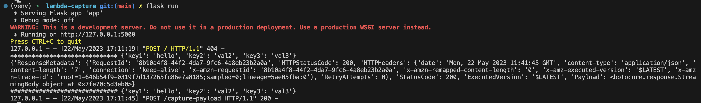
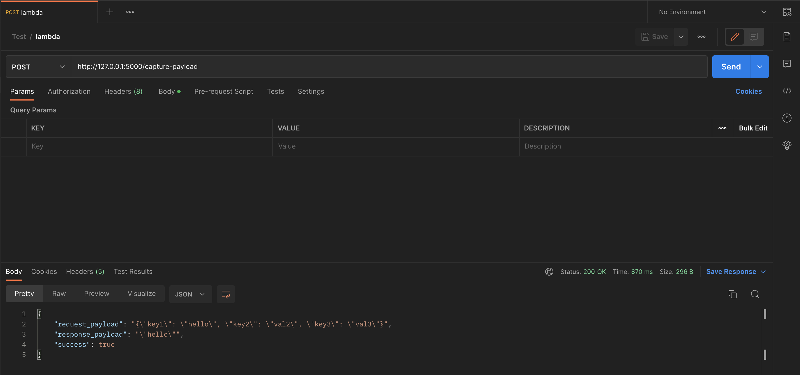
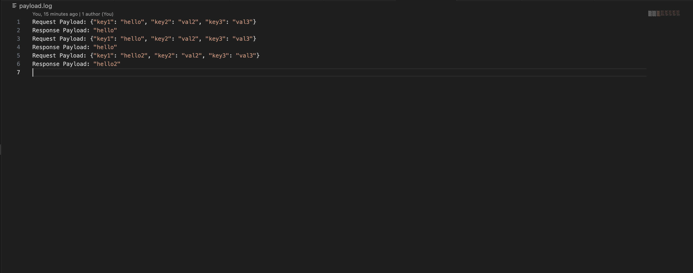
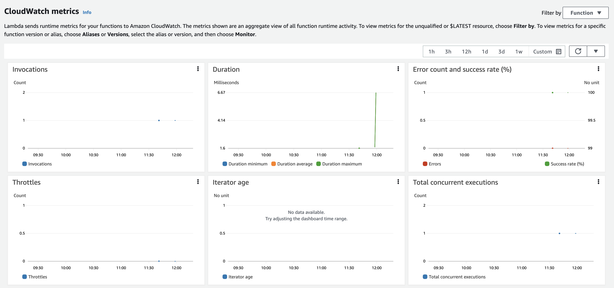

# Lambda Capture


[](https://www.python.org/)
[](https://github.com/saket13/iBatteryStats/blob/master/LICENSE)

A REST API and backend that will capture and report lambda payload information. 
The API will return the request and response as JSON for a specific lambda function


## Architecture

1. Set up the Lambda function in AWS and created a REST API in flask with necessary Environment Variables obtained from AWS account.
2. Invoke the target Lambda function(s) defind in the Enviroment variable, using the AWS SDK or Lambda service client, passing the captured request payload, and capture the response payload.
3. Store the request and response information in an appropriate data storage service such as Amazon DynamoDB or Amazon RDS, have used Log File for simplicity here, utilizing a schema that includes the Lambda function name, request payload, response payload, and any additional metadata required for reporting.
4. Implement a mechanism, such as another Lambda function or a scheduled job, to generate reports based on the stored data.


## Screenshots

**Flask Server and Making POST Requests to Server:**

|   |   |
|:---:|:---:|
| Flask Server | Postman Request |

**Capturing Payload and AWS Metrics for Lambda:**

|   |   |
|:---:|:---:|
| Capturing Payload | AWS Metrics |


## Getting Started

These instructions will get you a copy of the project up and running on your local machine for development and testing purposes.

### Prerequisites

Firstly,create a virtual environment in order to avoid any system wide python packages conflict with the project's environment
packages:

```
git clone https://github.com/houzen/lambda-capture
cd lambda-capture/
python3 -m venv venv;
source venv/bin/activate
pip install -r requirements.txt       (Installs all the dependencies of the project)
```


### Obtaining AWS Keys and setting up with project

After setting up project locally, obtain AWS Access Key and AWS Secret Access Key and store them in the .env file:

```
Create .env file and paste from env.sample file
Update the AWS Access Key and AWS Secret Access Key
```


### Setting up sample lambda function

It is needed to set up the lambda using the AWS Free Tier account:

```
https://aws.amazon.com/getting-started/hands-on/run-serverless-code/
Take help of this to set up the lambda and configure the TARGET_LAMBDA_FUNCTION_NAME in .env file
```

### Running Flask Server

``` 
flask run
```

### Testing

Use postman to do a POST request:
URL = http://127.0.0.1:5000/capture-payload

```
Sample JSON
{
    "key1": "hello2",
    "key2": "val2",
    "key3": "val3"
}
```
It will automatically create a new file payload.log capturing the details of request and response.
And, the same will be obtained from API endpoint as well.
