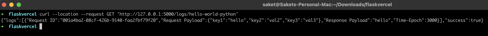

# Lambda Capture


[](https://www.python.org/)
[](https://github.com/saket13/iBatteryStats/blob/master/LICENSE)

A REST API and backend that will capture and report lambda payload information. 
The API will return the request and response as JSON for a specific lambda function


## Architecture

1. Set up the Lambda function in AWS and log the necessary payload (request-response and other details) to be captured in the invocation lambda function.
2. Enable CloudWatch Logs for your Lambda function by providing necessary IAM and make sure that log group associated with Lambda function is present and enabled.
3. Implement a REST API to retrieve and process the logs for the lambda function associated with the cloudwatch log group and format the logs as per requirements by using the appropriate AWS SDK (boto3 in our case) or API to interact with CloudWatch Logs.
4. Return the formatted logs as the API response to the client.


## Screenshots

**Flask Server and Making POST Requests to Server:**

|   |   |
|:---:|:---:|
| Flask Server | Logs API |

**Lambda function and AWS Metrics for Lambda:**

|   |   |
|:---:|:---:|
| Lambda function | AWS Metrics |


## Getting Started

These instructions will get you a copy of the project up and running on your local machine for development and testing purposes.

### Prerequisites

Firstly,create a virtual environment in order to avoid any system wide python packages conflict with the project's environment
packages:

```
git clone https://github.com/houzen/lambda-capture
cd lambda-capture/
python3 -m venv venv;
source venv/bin/activate
pip install -r requirements.txt       (Installs all the dependencies of the project)
```


### Obtaining AWS Keys and setting up with project

After setting up project locally, obtain AWS Access Key and AWS Secret Access Key and store them in the .env file:

```
Create .env file and paste from env.sample file
Update the AWS Access Key and AWS Secret Access Key
```


### Setting up sample lambda function

It is needed to set up the lambda using the AWS Free Tier account:

```
https://aws.amazon.com/getting-started/hands-on/run-serverless-code/
Take help of this to set up a general lambda function.
Change the existing code to one mentioned in screenshot and DEPLOY using UI of AWSLambda Console
```

### Running Flask Server

``` 
flask run
```

### Testing

Use postman to do a GET request:
URL = http://127.0.0.1:5000/logs/<function_name>

```
Where <function_name> is the name of the lambda function for which logs have to be obtained.
Sample JSON
{
    "logs":[
        {
            "Request ID":"001a4ba2-08cf-426b-9140-faa2fbf79f20",
            "Request Payload":
                {
                    "key1":"hello",
                    "key2":"val2",
                    "key3":"val3"
                },
            "Response Payload":"hello",
            "Time-Epoch":3000
        }
    ],
    "success":true
}
```
Further more, different kinds of filters can be added to this to get the logs for a date range or type of logs etc.
